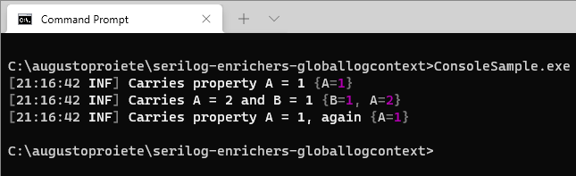

| README.md |
|:---|

<div align="center">


</div>

<h1 align="center">Serilog.Enrichers.GlobalLogContext</h1>
<div align="center">

A [Serilog](https://serilog.net) enricher to dynamically add properties to all log events of your application.

[](https://www.nuget.org/packages/Serilog.Enrichers.GlobalLogContext/) [](http://stackoverflow.com/questions/tagged/serilog)



</div>

## Give a Star! :star:

If you like or are using this project please give it a star. Thanks!

## Getting started :rocket:

Install the [Serilog.Enrichers.GlobalLogContext](https://www.nuget.org/packages/Serilog.Enrichers.GlobalLogContext/) package from NuGet:

```powershell
Install-Package Serilog.Enrichers.GlobalLogContext
```

Add the Serilog namespaces to your C# file:

```csharp
using Serilog;
using Serilog.Context;
```

Include the global log context enricher in your logger configuration:

```csharp
Log.Logger = new LoggerConfiguration()
    .Enrich.FromGlobalLogContext()
    // ... other configuration ...
    .CreateLogger();
```

The `FromGlobalLogContext()` enricher dynamically adds properties present in the `Serilog.Context.GlobalLogContext`, to _all_ produced events in your application.

Then, properties can be added and removed from the global log context using `GlobalLogContext.PushProperty()`:

```csharp
GlobalLogContext.PushProperty("AppVersion", GetThisAppVersion());
GlobalLogContext.PushProperty("OperatingSystem", GetCurrentOS());
```

After the code above is executed, any log event written to any Serilog sink will carry the properties `AppVersion` and `OperatingSystem` automatically.

### Replacing and removing properties

When properties are added to the global log context, a disposable object is returned, which can be used to remove the property from the global stack at a later time:

```csharp
GlobalLogContext.PushProperty("A", 1);

Log.Information("Carries property A = 1");

using (GlobalLogContext.PushProperty("A", 2))
using (GlobalLogContext.PushProperty("B", 1))
{
    Log.Information("Carries A = 2 and B = 1");
}

Log.Information("Carries property A = 1, again");
```

Pushing a property onto the global log context will override any existing properties with the same name, until the object returned from `PushProperty()` is disposed, as the property `A` in the example demonstrates.

**Important:** properties _must_ be popped from the global log context in the precise order in which they were added. Behavior otherwise is undefined.

### Multi-threading

By design, for performance reasons, adding or removing properties in the global log context are *not* thread-safe operations. If you have multiple threads modifying the `GlobalLogContext` at the same time, you should call `Lock` or `LockAsync` before making changes to the `GlobalLogContext`. e.g.:

```csharp
// sync
using (GlobalLogContext.Lock())
{
    GlobalLogContext.PushProperty("A", 3);
}

// async
using (await GlobalLogContext.LockAsync())
{
    GlobalLogContext.PushProperty("A", 3);
}
```

### Example of a .NET app using GlobalLogContext

In the [sample](sample/) folder, there's an example of a .NET app that uses Serilog for logging to the `Console` using this enricher, as described above.

## Why not just use `.Enrich.With` or `.Enrich.WithProperty`?

When setting up the Serilog logging pipeline, you have the option to include properties in all log events using a native feature of Serilog:

```csharp
Log.Logger = new LoggerConfiguration()
    .Enrich.WithProperty("AppVersion", GetThisAppVersion())
    .Enrich.WithProperty("OperatingSystem", GetCurrentOS())
    // ... other configuration ...
    .CreateLogger();
```

The equivalent using `Serilog.Enrichers.GlobalLogContext` would be:

```csharp
Log.Logger = new LoggerConfiguration()
    .Enrich.FromGlobalLogContext()
    // ... other configuration ...
    .CreateLogger();

// ... other code ...

GlobalLogContext.PushProperty("AppVersion", GetThisAppVersion());
GlobalLogContext.PushProperty("OperatingSystem", GetCurrentOS());
```

As you can see, the main difference is that `Serilog.Enrichers.GlobalLogContext` allows you to add properties at a later time, long _after_ your Serilog logging pipeline has been configured, which can be very useful in scenarios where the properties being added are not immediately available during the bootstrapping of the app. In addition, properties in the `GlobalLogContext` can be replaced or removed at any time during the execution of the app.

## Release History

Click on the [Releases](https://github.com/serilog-contrib/serilog-enrichers-globallogcontext/releases) tab on GitHub.

---

_Copyright &copy; 2021-2023 C. Augusto Proiete & Contributors - Provided under the [Apache License, Version 2.0](LICENSE)._
